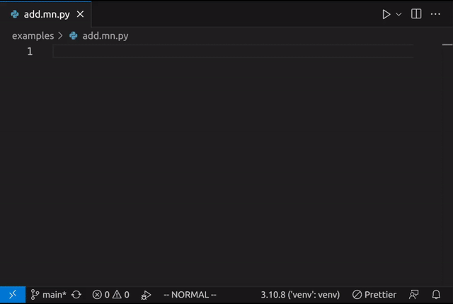

Maccarone VS Code Extension
===========================

See [the core Maccarone documentation](https://github.com/bsilverthorn/maccarone) **first**! That will explain the key concepts behind this tool.

This README documents the VS Code extension _only_.

## Usage

The extension provides a single command, `Refresh AI Blocks`, which updates the Maccarone code sections `#<<...>>` in the current file. Run it using the VS Code [command palette](https://code.visualstudio.com/docs/getstarted/userinterface#_command-palette) (`Ctrl+Shift+P`):

## Setup

Install the free extension from [the VS Code marketplace](https://marketplace.visualstudio.com/items?itemName=maccarone.maccarone).

Make sure you have Python **3.10+** installed and configured as the default interpreter in VS Code.

You'll need an OpenAI API key **with GPT-4 access**. Set it in your environment as `OPENAI_API_KEY`, or configure it in VS Code under the Maccarone extension settings.
